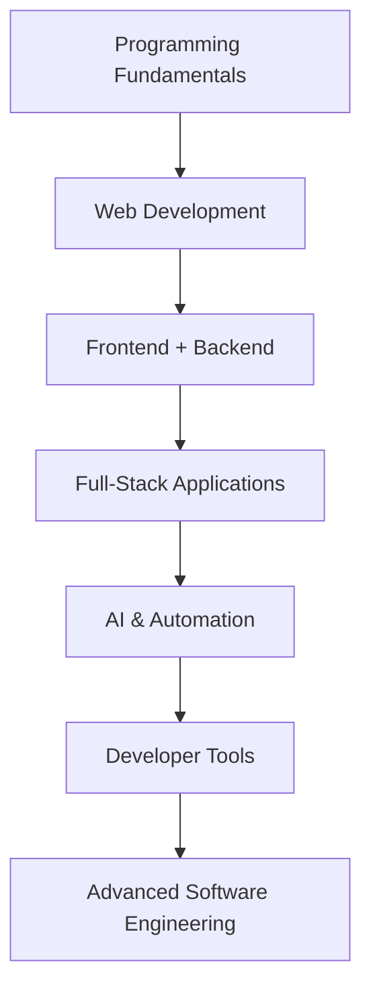

<div align="center">


<a href="https://github.com/agastyatomar/AETHER">
  
</a>

<br/>

[](https://github.com/agastyatomar)
[](#)
[](#)

</div>

I'm Agastya Tomar (**Aadi**), a student and independent developer from India who enjoys building practical software, modern web experiences, developer tools, and automation systems.

I'm focused on learning by building real projects, experimenting with new technologies, and turning ideas into useful products.

<br/>

## 🚀 About Me

```yaml
name: Agastya Tomar
alias: Aadi
role: Student & Aspiring Software Engineer
focus:
  - Full-Stack Web Development
  - AI, Agents & Automation
  - Modern UI/UX experiences
  - Android, Termux & mobile dev workflows
  - Developer tools & productivity systems
  - Cloud, storage & backend systems
currently: strengthening programming & software-engineering fundamentals
mindset: learning beginner → advanced, one real project at a time
```

<br/>

## 🧠 What I'm Interested In

<table>
<tr>
<td valign="top" width="50%">

**🌐 Web Development**
- Frontend
- Backend
- APIs
- Full-Stack Applications

**🤖 AI & Automation**
- AI Agents
- LLM Applications
- Developer Automation
- Workflow Automation
- Local AI

</td>
<td valign="top" width="50%">

**🛠️ Developer Tools**
- CLI Tools
- IDE Concepts
- Git & GitHub
- Termux
- Productivity Systems

**🎨 Design**
- Modern UI/UX
- Responsive Interfaces
- Animations
- Glassmorphism
- Interactive Experiences

</td>
</tr>
</table>

<br/>

## 🔭 Currently Building

<div align="center">

</div>

**AETHER** — a personal AI ecosystem focused on bringing AI agents, voice interaction, coding workflows, automation, tools and knowledge systems together in one developer-focused environment.

<table>
<tr>
<td>🤖 AI Agents</td>
<td>🎙️ Voice interaction</td>
<td>💻 Agentic coding</td>
</tr>
<tr>
<td>🧩 Plugins & skills</td>
<td>🔌 MCP integrations</td>
<td>🧠 Memory & knowledge</td>
</tr>
<tr>
<td>⚙️ Automation & workflows</td>
<td>🖥️ Developer workspace</td>
<td>🔐 Secure tool execution</td>
</tr>
</table>

📌 **Repository:** [github.com/agastyatomar/AETHER](https://github.com/agastyatomar/AETHER)

<br/>

## 🛠️ Technologies I'm Exploring

<div align="center">

**Web**


**Backend**


**AI & Tools**


**UI / Creative**


</div>

> I'm continuously learning, so this list represents technologies I'm exploring rather than claiming expertise in all of them.

<br/>

## 🎯 My Learning Journey



My goal is not just to learn technologies, but to understand how software actually works and use that knowledge to solve real problems.

<br/>

## 🧪 My Approach

<div align="center">

### `Learn → Build → Break → Fix → Improve → Repeat`

</div>

I prefer practical learning through projects rather than only following tutorials. Every project is a chance to learn more about **architecture, programming, UI/UX, APIs, databases, automation, security, performance,** and **open-source development**.

<br/>

## 📊 GitHub Stats

<div align="center">


</div>

<br/>

## 🐍 Contribution Snake

<div align="center">

</div>

> Set this up via the free [`platane/snk`](https://github.com/Platane/snk) GitHub Action — it generates an animated snake that "eats" your contribution graph, committed to an `output` branch on a schedule.

<br/>

## 💡 Philosophy

<div align="center">

*Don't just use technology.*
**Understand it. Build with it. Improve it. Share it.**

</div>

<br/>

## ⚡ Fun Fact

> I enjoy taking an idea that starts as *"What if I built this?"*
> and turning it into *"It's actually working. 🚀"*

<br/>

## 🌐 Connect With Me

<div align="center">

[](https://github.com/agastyatomar)
[](#)
[](#)

**Name:** Agastya Tomar · **Nickname:** Aadi · **Location:** India 🇮🇳

</div>

<br/>


<div align="center">

⭐ **Thanks for visiting my profile!** Explore my repositories and follow along as I build, learn, and improve.


</div>
